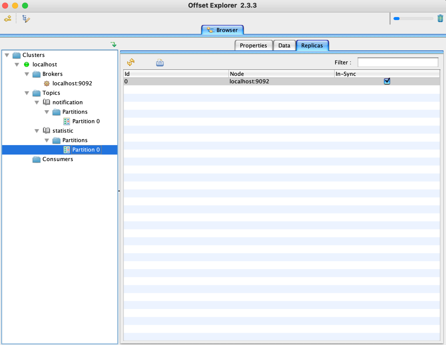
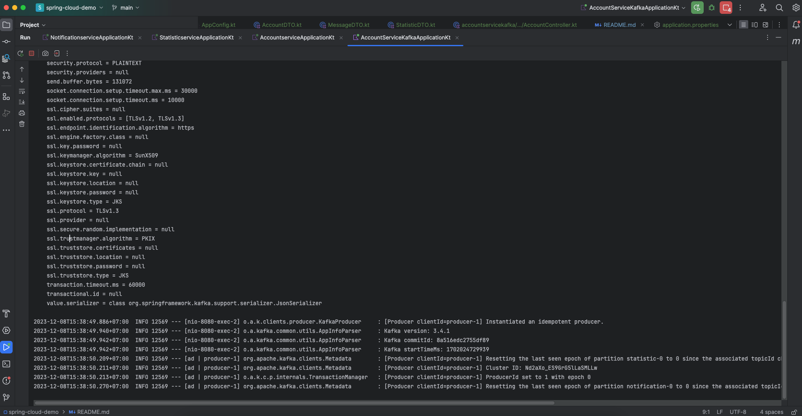

# spring-cloud-demo
Spring Cloud Demo with Kotlin

## Demo Kafka Spring boot + Kotlin send even push kafka server:

Khi con account-service-kafka send message email thì thằng notification-service sẽ nhận được thông báo gửi tới.

